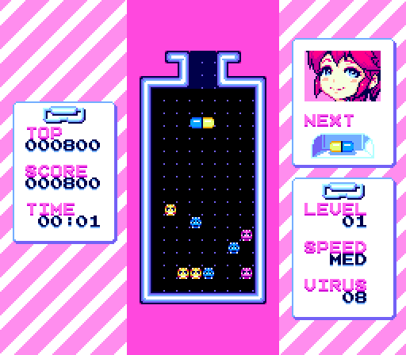
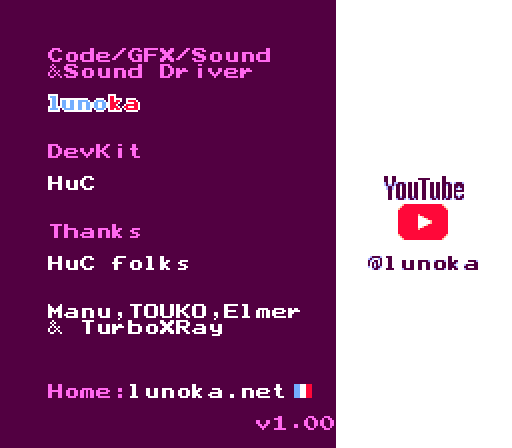

  

<h1 align="center">PopPCE</h1>

  
  

  
  
   
  
  

画面は lunoka 氏の <a href="https://lunoka.itch.io/mai-nurse">「Mai Nurse」</a> を PopPCE の x1(等倍)表示で動かしたものです(作者の許可を得て掲載。下の「クレジット」を参照)。

**非公式・非商用の改変版です。** PopPCE は、Fredrik Ahlström 氏の PC エンジン エミュレータ [NitroGrafx](https://github.com/FluBBaOfWard/NitroGrafx) を、SHARP の電子辞書 Brain PW-G5300(Windows CE)向けに移植した**非公式**の改変版です。NitroGrafx の公式版ではありません。元の作者はこの移植に関わっておらず、サポートもしていません。不具合の報告は、NitroGrafx ではなくこちらにお願いします。利用の根拠は [NitroGrafx issue #20](https://github.com/FluBBaOfWard/NitroGrafx/issues/20) での作者の返信です(公式版と偽らないこと、商用利用しないこと)。

**Unofficial, non-commercial port.** PopPCE is an unofficial port of NitroGrafx by Fredrik Ahlström to the SHARP Brain PW-G5300 (Windows CE). It is not an official NitroGrafx release, and the original author is not involved in it and does not support it. Please do not report PopPCE issues upstream. Permission: the author's reply in [issue #20](https://github.com/FluBBaOfWard/NitroGrafx/issues/20) (do not impersonate his releases, no commercial use).

## ダウンロード
最新版は Releases のページからダウンロードできます。
https://github.com/daizu-coder/PopPCE/releases/latest

## アプリのインストール
Brainへのインストールは[アプリの起動方法](https://brain.fandom.com/ja/wiki/アプリの起動方法)を参照してください。

HuCard のゲーム(`.pce`)と SuperGrafx のゲーム(`.sgx`)は、そのまま開けます。

CD-ROM² のゲームは、`.cue` と、それに対応する1つの `.bin` の組で開きます(`.cue` を選びます)。遊ぶには、CD-ROM² のシステムカードのイメージが別に必要です。システムカードは同梱していないので、ご自身で用意してください。

- システムカードのファイル名は自由です。拡張子は `.pce` にしてください(256KB。先頭に 512 バイトのヘッダが付いたものも使えます)
- CD のイメージ(`.cue`)と同じフォルダか、`AppMain.exe` と同じフォルダに置いてください。そのフォルダの中だけを探します(サブフォルダは探しません)
- どちらにも見つからないときは、メッセージのあとにファイルを選ぶ画面が出るので、システムカードを選んでください。選んだフォルダは覚えていて、次からは最初にそこを探します
- システムカードかどうかは中身で見分けるので、HuCard のゲームと同じフォルダに置いても大丈夫です。何枚かあるときは、SUPER CD-ROM² のシステムカード 3.0 を選びます

## 制作について
コードとマスコットの絵はAI(Claude)で作りました。製作者はプログラムを読めません。

## ライセンスと商標
PopPCE 全体は、NitroGrafx の作者の条件(非公式・非商用)で配布します。PopPCE の自作部分は MIT ライセンス、マスコットの絵とアイコンは CC0 1.0 です。

「PCエンジン」「PC Engine」「CD-ROM²」「SUPER CD-ROM²」「スーパーグラフィックス」「SuperGrafx」「TurboGrafx」などは、それぞれの権利者の商標です。「SHARP」「Brain」はシャープ株式会社の商標です。PopPCE は、NEC、ハドソン、コナミ、シャープなどの権利者とは関係ありません。

ライセンスの詳しい説明は [CE/LICENSING.md](../CE/LICENSING.md) にあります。

ゲームの ROM、CD のイメージ、CD-ROM² のシステムカード(BIOS)は同梱していません。

## ビルド方法、使用方法
ソースを取得するときは `git clone --recursive` を使ってください。サブモジュール(ARMH6280、NDS_Shared)を使っているので、`--recursive` なしのクローンや「Download ZIP」ではビルドできません。

ビルド方法と使用方法は [CE/README.md](../CE/README.md) をご覧ください。

## クレジット

PopPCE は、次の方々の作品を使わせていただいています。ありがとうございます。

- **NitroGrafx、ARMH6280(CPU)、PCEPSG(音源)**(エミュレータ本体):Fredrik Ahlström 氏。作者の許諾([issue #20](https://github.com/FluBBaOfWard/NitroGrafx/issues/20))によって使っています。移植を快く認めてくださり、不具合の報告にも丁寧に対応していただきました。上流は [FluBBaOfWard/NitroGrafx](https://github.com/FluBBaOfWard/NitroGrafx) です。ARMH6280 の多くの部分は、Loopy 氏が始めた PocketNES をもとにしています。
- **Shared(NDS_Shared)**:Fredrik Ahlström 氏。MIT ライセンス。
- **CUE ファイルの読み込み(CUEParser)**:Rabbit Hole Computing、Fredrik Ahlström 氏。MIT ライセンス。
- **libretro API のヘッダ**:The RetroArch team。MIT ライセンス。
- **SuperGrafx のゲームの CRC の一覧**(`.pce` の SuperGrafx のゲームを見分けるもの):CRC の値とゲーム名(6件)は、事実のデータとして beetle-supergrafx-libretro の一覧を参考にしました(Mednafen のコードは使っていません)。一覧をまとめてくださった Mednafen project と libretro の移植チームに感謝します。
- **東雲フォント(16ドット)**(画面の文字):古川泰之氏ほか、/efont/(電子書体オープンラボ)。実質パブリックドメイン。
- **Galmuri フォント**(画面の文字):Lee Minseo 氏([quiple/galmuri](https://github.com/quiple/galmuri))。SIL Open Font License 1.1。
- **マスコットの絵とアイコン**:AI(Claude)で作りました。CC0 1.0(パブリックドメイン)。
- **スクリーンショットのゲーム**:[「Mai Nurse」](https://lunoka.itch.io/mai-nurse)、作者は lunoka 氏です。作者の許可を得て、この README に掲載しています。スクリーンショットの画像(`.github/screenshots/`)は、このリポジトリのライセンス(NitroGrafx の作者の条件、MIT、CC0 1.0)の対象外で、ゲームの著作権は作者にあります。

それぞれの著作権表示とライセンスの全文は [CE/THIRDPARTY_LICENSES.txt](../CE/THIRDPARTY_LICENSES.txt) にあります。
